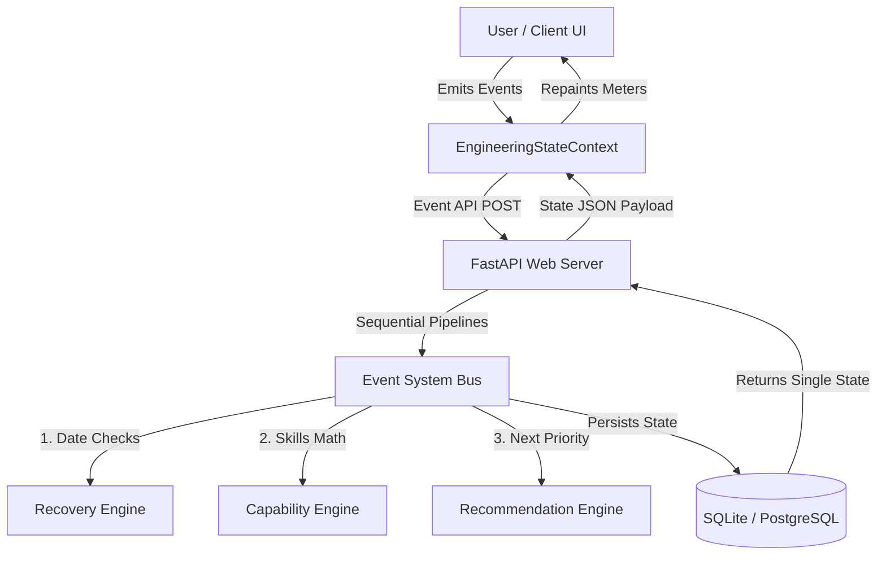

# EJP Engineering Operating System - ARCHITECTURE.md

This document describes the software architecture implemented in the **Engineering Journey Platform (EJP) Version 1.0**.

---

## 🏛️ System Overview

The platform is designed as a self-contained personal **Engineering Operating System (EOS)** helping developers navigate structured learning grids, track schedule variance, calculate active capability vectors, and query context-aware mentors.



---

## 📂 Codebase Layout

```
/Users/k.sathvik/.gemini/antigravity/scratch/
├── backend/
│   ├── app/
│   │   ├── main.py             # FastAPI App Shell & Startup DB Seeder
│   │   ├── database.py         # SQLAlchemy connection & session providers
│   │   ├── models/
│   │   │   ├── base.py         # SQLAlchemy declarative base mapper
│   │   │   └── state.py        # Centralized EngineeringState DB Schema
│   │   ├── services/
│   │   │   ├── event_system.py # Sequential Event pipeline dispatcher
│   │   │   ├── capability.py   # Skill metric and domain capability calculator
│   │   │   ├── recovery.py     # Graduation dates buffer & slippage engine
│   │   │   └── recommendation.py # Priority task & justification engine
│   │   └── routers/
│   │       ├── state.py        # State API fetches & event mutation posts
│   │       ├── syllabus.py     # Dynamic backend-managed syllabus provider
│   │       └── ai.py           # Context-aware chat completions router
│   └── tests/
│       └── test_engines.py     # Unittest coverage suite for core engine logic
└── frontend/
    └── src/
        ├── App.tsx             # Client navigation controller
        ├── main.tsx            # React DOM mounting entrypoint
        ├── index.css           # Slate-Dark aesthetic theme tokens
        ├── data/
        │   └── roadmapGraph.ts # SVG Flowchart coordinate nodes & prerequisite edges
        ├── context/
        │   └── EngineeringStateContext.tsx # Central client state coordinator
        └── components/
            ├── MissionControl.tsx     # Dynamic metrics & recommendation dashboard
            ├── RoadmapVisualizer.tsx  # Symmetrical SVG flowchart node canvas
            ├── TopicDrawer.tsx        # Enriched 10-element syllabus drawer
            ├── TimerCard.tsx          # Stopwatch countdown exit gate validator
            └── AiMentorDrawer.tsx     # State-validated AI chat sidebar
```

---

## ⚡ Core Engine Interlocks

1. **State Mutation (The Event Bus):**
   No component modifies database records directly. When a user marks a task completed or changes simulated calendars, they emit events (e.g. `TOGGLE_TASK`, `PASS_ASSESSMENT`, `SET_DATE`, `TRIGGER_FREEZE`) to the `/api/state/event` endpoint.
2. **Processing Pipeline:**
   Upon receiving an event, [event_system.py](file:///Users/k.sathvik/.gemini/antigravity/scratch/backend/app/services/event_system.py) intercepts the context, executes the **Recovery Engine**, triggers the **Capability Engine**, updates the **Recommendation Engine**, and writes the resulting `EngineeringState` transaction.
3. **Reactive UI Repaints:**
   The frontend context [EngineeringStateContext.tsx](file:///Users/k.sathvik/.gemini/antigravity/scratch/frontend/src/context/EngineeringStateContext.tsx) catches the returned state, triggering react hooks to repaint metrics and graph glow loops instantly.
